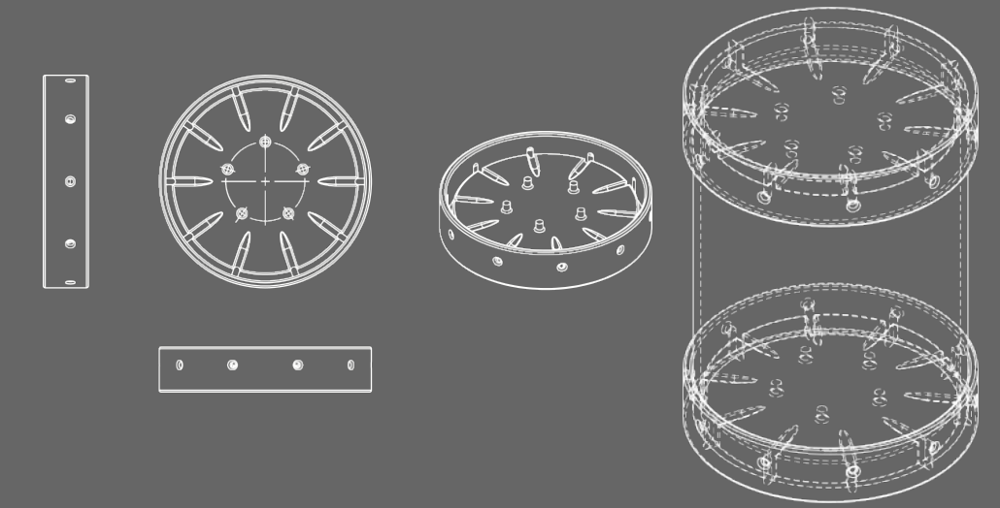
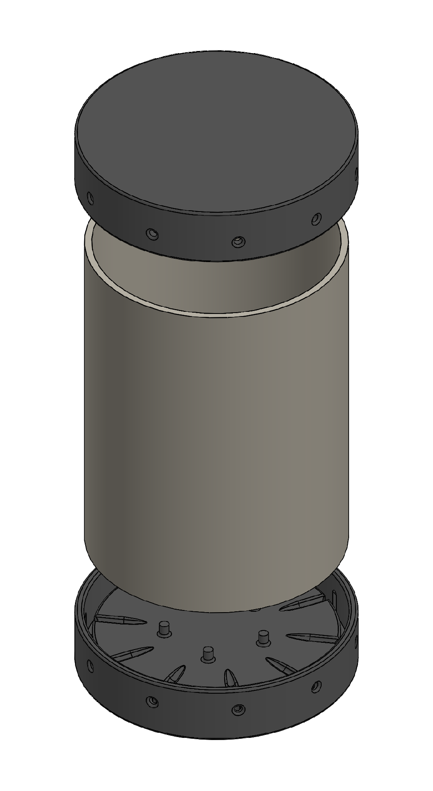

# Project description

The aim of the project was to design and construct custom containers for germinating Arabidopsis thaliana seedlings in a lightproof environment. These containers should be designed to prevent any external light from entering, ensuring a completely dark environment for seedling etiolation. Additionally, it is essential to maintain an atmosphere inside the container as similar as possible to the ambient conditions outside the Skotobox by allowing for adequate air exchange. In our case, the seedlings are placed on the culture medium within a 100 mm diameter Petri dish. Instead of utilizing the original lid of the dish, the base of a second dish is employed and securely sealed with surgical tape. This is essential to provide the necessary vertical space for the growth of the etioated seedlings.

  

Figure 1: An exploded view of the Skotobx

The Skotobox (Figure 1) is a cylindrical container consisting of two 3D-printed lids (Figure 3) installed at the ends of a 110 mm PVC pipe, which can be cut according to user needs, tipically depending on the clearance between the bottom and top shelves in the  chamber. The design of the lids ensures a lightproof seal while allowing for proper air exchange through dedicated grooves in the two  (Figure 3 and 4). Furthermore, the lids feature a specialized palisade-like structure (Figure 3) that has been demonstrated to effectively prevent condensation inside the Petri dishes.
 Arabidopsis thaliana seedlings grown inside the Skotobox allowed a complete etiolation proving the efficiency the box (Figure 6). Compared to other methods of light shielding, such as aluminum foil, the Skotobox offers the advantage of establishing uniform complete darkness while maintaining effective air exchange while reducing usage of aluminum foil for sustainable science practices.

